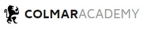

<div id="top"></div>

<!-- PROJECT SHIELDS -->
<!--
*** I'm using markdown "reference style" links for readability.
*** Reference links are enclosed in brackets [ ] instead of parentheses ( ).
*** See the bottom of this document for the declaration of the reference variables
*** for contributors-url, forks-url, etc. This is an optional, concise syntax you may use.
*** https://www.markdownguide.org/basic-syntax/#reference-style-links
-->
[![Contributors][contributors-shield]][contributors-url]
[![Forks][forks-shield]][forks-url]
[![Stargazers][stars-shield]][stars-url]
[![Issues][issues-shield]][issues-url]
[![MIT License][license-shield]][license-url]
[![LinkedIn][linkedin-shield]][linkedin-url]

<!-- PROJECT LOGO -->
<br />
<div align="center">
  <a href="https://anderson-marcelo-bastos-lima.github.io/colmar-academy/">
    
  </a>

  <h3 align="center">Colmar Academy</h3>

  <p align="center">
    Creating the landing page for a new school.
    <br />
    <a href="https://github.com/anderson-marcelo-bastos-lima/colmar-academy#readme"><strong>Explore the docs »</strong></a>
    <br />
    <br />
    <a href="https://anderson-marcelo-bastos-lima.github.io/colmar-academy/">View Demo</a>
    ·
    <a href="https://github.com/anderson-marcelo-bastos-lima/colmar-academy/issues">Report Bug</a>
    ·
    <a href="https://github.com/anderson-marcelo-bastos-lima/colmar-academy/issues">Request Feature</a>
  </p>
</div>


<!-- TABLE OF CONTENTS -->
<details>
  <summary>Table of Contents</summary>
  <ol>
    <li>
      <a href="#about-the-project">About The Project</a>
      <ul>
        <li><a href="#built-with">Built With</a></li>
      </ul>
    </li>
    <li>
      <a href="#what-the-project-does">What the project does?</a>
    </li>
    <li><a href="#why-the-project-is-useful">Why the project is useful?</a></li>
    <li><a href="#how-users-can-get-started-with-the-project">How users can get started with the project?</a></li>
    <li><a href="#who-maintains-and-contributes-to-the-project">Who maintains and contributes to the project?</a></li>
    <li><a href="#license">License</a></li>
    <li><a href="#contact">Contact</a></li>
    <li><a href="#acknowledgments">Acknowledgments</a></li>
  </ol>
</details>


<!-- ABOUT THE PROJECT -->
## About The Project

[![Product Name Screen Shot][product-screenshot]](https://example.com)

Colmar Academy's project is the final exercise to conclude the training in building a website with HTML, CSS, and Github Pages.

<p align="right">(<a href="#top">back to top</a>)</p>


### Built With
* [Git](https://git-scm.com/)
* [GitHub](https://github.com/)
* [GitHub Pages](https://pages.github.com/)
* [HTML5](https://en.wikipedia.org/wiki/HTML5)
* [CSS3](https://en.wikipedia.org/wiki/CSS)
* [Bootstrap](https://getbootstrap.com)

<p align="right">(<a href="#top">back to top</a>)</p>


<!-- WHAT THE PROJECT DOES -->
## What the project does

The project shows the HTML and CSS implementation of a wireframe document.
A wireframe is a document that contains the placement of elements on a page without specifying any other design information.

<p align="right">(<a href="#top">back to top</a>)</p>


<!-- WHY THE PROJECT IS USEFUL -->
## Why the project is useful

The project helps understand the transformation of a wireframe document into a website.
The wireframe document contains the placement of elements on a page without specifying any other design information, so in the website coding process, some design decisions are necessary to complete the website.

<p align="right">(<a href="#top">back to top</a>)</p>


<!-- HOW USERS CAN GET STARTED WITH THE PROJECT -->
## How users can get started with the project

1. Clone the repo
   ```sh
   git clone https://github.com/anderson-marcelo-bastos-lima/colmar-academy.git
   ```

<p align="right">(<a href="#top">back to top</a>)</p>


<!-- WHERE USERS CAN GET HELP WITH YOUR PROJECT -->
## Where users can get help with your project

Consult the GitHub documentation to learn how to use GitHub and get a local copy of the project on your computer.

* [GitHub Docs](https://docs.github.com/)

<p align="right">(<a href="#top">back to top</a>)</p>


<!-- WHO MAINTAINS AND CONTRIBUTES TO THE PROJECT -->
## Who maintains and contributes to the project

Contributions are what make the open source community such an amazing place to learn, inspire, and create. Any contributions you make are **greatly appreciated**.

If you have a suggestion that would make this better, please fork the repo and create a pull request. You can also simply open an issue with the tag "enhancement".
Don't forget to give the project a star! Thanks again!

1. Fork the Project
2. Create your Feature Branch (`git checkout -b feature/AmazingFeature`)
3. Commit your Changes (`git commit -m 'Add some AmazingFeature'`)
4. Push to the Branch (`git push origin feature/AmazingFeature`)
5. Open a Pull Request

<p align="right">(<a href="#top">back to top</a>)</p>


<!-- LICENSE -->
## License

Distributed under the MIT License. See `LICENSE.txt` for more information.

<p align="right">(<a href="#top">back to top</a>)</p>


<!-- ACKNOWLEDGMENTS -->
## Acknowledgments

* [Codecademy](https://www.codecademy.com/)
* [Google](https://www.google.com/)
* [Git](https://git-scm.com/)
* [GitHub](https://github.com/)
* [GitHub Pages](https://pages.github.com/)
* [Bootstrap](https://getbootstrap.com/)
* [Visual Studio Code](https://code.visualstudio.com/)

<p align="right">(<a href="#top">back to top</a>)</p>


<!-- MARKDOWN LINKS & IMAGES -->
<!-- https://www.markdownguide.org/basic-syntax/#reference-style-links -->
[contributors-shield]: https://img.shields.io/github/contributors/anderson-marcelo-bastos-lima/colmar-academy.svg?style=for-the-badge
[contributors-url]: https://github.com/anderson-marcelo-bastos-lima/colmar-academy/graphs/contributors
[forks-shield]: https://img.shields.io/github/forks/anderson-marcelo-bastos-lima/colmar-academy.svg?style=for-the-badge
[forks-url]: https://github.com/anderson-marcelo-bastos-lima/colmar-academy/network/members
[stars-shield]: https://img.shields.io/github/stars/anderson-marcelo-bastos-lima/colmar-academy.svg?style=for-the-badge
[stars-url]: https://github.com/anderson-marcelo-bastos-lima/colmar-academy/stargazers
[issues-shield]: https://img.shields.io/github/issues/anderson-marcelo-bastos-lima/colmar-academy.svg?style=for-the-badge
[issues-url]: https://github.com/anderson-marcelo-bastos-lima/colmar-academy/issues
[license-shield]: https://img.shields.io/github/license/anderson-marcelo-bastos-lima/colmar-academy.svg?style=for-the-badge
[license-url]: https://github.com/anderson-marcelo-bastos-lima/colmar-academy/blob/main/docs/LICENSE.txt
[linkedin-shield]: https://img.shields.io/badge/-LinkedIn-black.svg?style=for-the-badge&logo=linkedin&colorB=555
[linkedin-url]: https://www.linkedin.com/in/anderson-marcelo-bastos-lima/
[product-screenshot]: ./docs/Screenshot.jpg